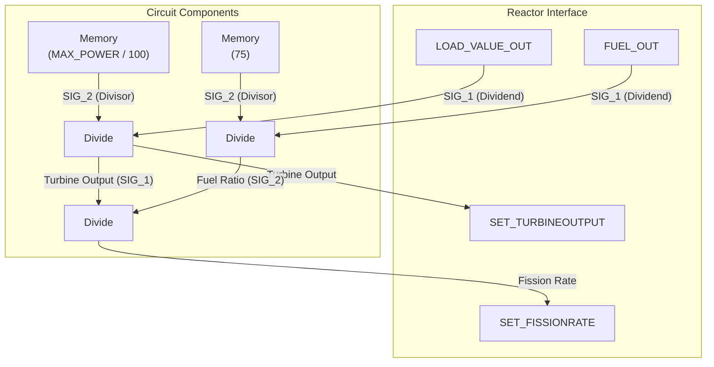

# Document 00: Autonomous Reactor Control System

---

### **DOCUMENT INFORMATION**

| Field | Value |
| :--- | :--- |
| **Document ID** | `00-ReactorController` |
| **Circuit Name** | Autonomous Reactor Control System |
| **Author** | Xavrax |
| **Version** | 1.0 (Initial Draft) |
| **Classification** | Top Secret (Do not distribute to clowns or rival submarines) |
| **Date**| 04.07.2k25 |

---

### 1. Circuit Overview

This document details the design and implementation of the Autonomous Reactor Control System. Its purpose is to manage the ship's reactor with minimal human intervention, freeing up the engineering team for more critical tasks, such as patching up the hull with duct tape or arguing about who gets the last welding fuel tank.

The circuit ensures a stable power supply by automatically adjusting turbine output and fission rate in response to the submarine's fluctuating power demands. In short, it's the only thing standing between us and a very sudden, very bright, and very final meltdown. It keeps the reactor powered as it should be, so you don't have to.

### 2. Functional Description

The circuit operates on two core mathematical principles, ensuring the reactor's output dynamically matches the submarine's power requirements without the need for manual fiddling. This prevents both brownouts during high-demand situations (like engaging the main engines while the discharge coils are firing) and fuel wastage during quiet periods.

1.  **Turbine Control:** The turbine output is determined by the equation:
    `TURBINEOUTPUT = LOAD / (MAX_POWER / 100)`
    This formula scales the ship's current `LOAD` against the reactor's `MAX_POWER` output. The division by 100 is a scaling factor that converts the max power into a percentage-based value, allowing the turbine to precisely match the power draw.

2.  **Fission Rate Control:** The fission rate is determined by the equation:
    `FISSIONRATE = TURBINEOUTPUT / (FUEL_OUT / 75)`
    This adjusts the fission rate based on the quality of the fuel currently in the reactor (`FUEL_OUT`). The `75` is a finely-tuned constant that our predecessors discovered (probably through a lot of trial, error, and explosions). It ensures that rods of varying quality can produce the required power, preventing the system from under- or over-powering when fuel is swapped.

This setup represents the smallest possible fully autonomous configuration, making it an elegant and efficient choice for most applications.

### 3. Required Components

-   3x Divide Component
-   2x Memory Component
-   A healthy fear of the abyss
-   Sufficient cabling to anger the ship's quartermaster
-   One (1) engineer who knows which end of a screwdriver to hold.

### 4. Circuit Diagram

### 5. Installation & Wiring

*To be detailed in a future revision. For now, find Xavrax and ask for the schematic. Bribe with ethanol if necessary.*

---

### 6. OPERATIONAL NOTES & WARNINGS

-   :warning: **WARNING:** This is an *automated* system, not a magical one. It will not protect the reactor from direct weapons fire, sabotage by a traitorous crewmate, or the percussive maintenance techniques of an enraged security officer.
-   :information_source: **NOTE:** If the lights are flickering and you hear a sound akin to a thousand angry hornets, the circuit is likely trying its best. It's not its fault someone decided to power on all the discharge coils at once.
-   :memo: **MEMO:** Any modifications to this circuit must be logged and approved. Unauthorized "improvements" will be tested by having the responsible party manually hug the reactor during a load spike.
