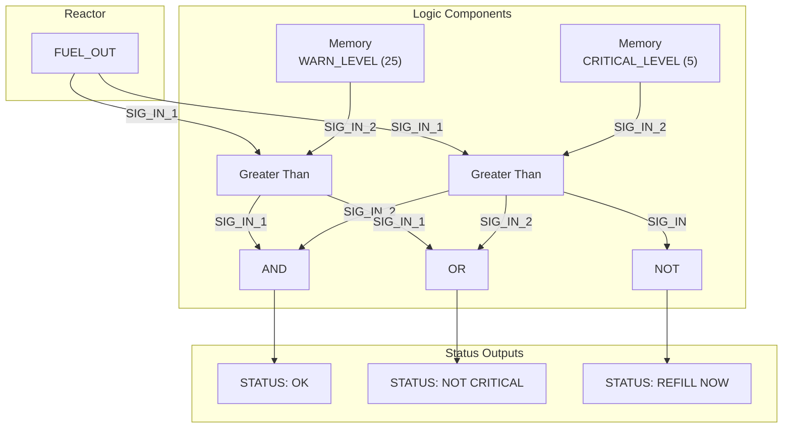

# Document 01: Reactor Fuel Level Detector

---

### **DOCUMENT INFORMATION**

| Field | Value |
| :--- | :--- |
| **Document ID** | `01-ReactorFuelDetector` |
| **Circuit Name**| Dual-Threshold Fuel Alarm |
| **Author** | Xavrax |
| **Version** | 1.0 |
| **Classification** | Standard Issue (Required knowledge for all engine-room personnel) |
| **Date**| 09.07.2k25 |

---

### 1. Circuit Overview

This document details the standard-issue fuel level detection circuit. Its purpose is to provide clear, unambiguous warnings about the state of the reactor's fuel reserves, preventing the awkward situation where the lights go out mid-way through a Moloch attack. The system provides two distinct alert levels: a gentle "warning" and a more... *insistent* "critical" alarm.

These thresholds are fully adjustable via memory components, though tinkering with the recommended values is generally followed by a stern lecture from the Captain and a period of intense regret.

### 2. Functional Description

The circuit constantly compares the reactor's `FUEL_OUT` value against two preset thresholds. The recommended (and sane) values are:
-   **Warning Level:** `25`
-   **Critical Level:** `5`

Based on these comparisons, the circuit provides three distinct output signals, allowing for nuanced responses from a simple status light to a full-blown, siren-blaring panic alarm.

-   **AND Gate Output (Fuel OK):** This signal is `1` only when the fuel level is above the `WARN_LEVEL`. Think of it as the "everything is fine, for now" indicator.
-   **OR Gate Output (Non-Critical):** This signal is `1` as long as the fuel level is above the `CRITICAL_LEVEL`. It's a simple "we're not about to drift lifelessly into the abyss" check.
-   **NOT Gate Output (Refill Immediately):** This signal is `1` only when the fuel level drops below the `CRITICAL_LEVEL`. When this signal is active, it's time to find a new fuel rod. Yesterday.

### 3. Required Components

-   2x Memory Component
-   2x Greater Than Component
-   1x AND Component
-   1x OR Component
-   1x NOT Component
-   Cables, and the courage to work near a live reactor.

### 4. Circuit Diagram

### 5. Installation & Wiring

*To be detailed in a future revision. For now, find Xavrax and ask for the schematic. Bribe with ethanol if necessary.*

### 6. OPERATIONAL NOTES & WARNINGS

-   :warning: **WARNING:** Do not set the `WARN_LEVEL` lower than the `CRITICAL_LEVEL`. This will cause what is technically known as a "logic paradox" and, more practically, will render the entire circuit useless.
-   :information_source: **NOTE:** This circuit only reports the fuel level. It will not magically create new fuel rods or prevent the security officer from using them as improvised clubs.
-   :memo: **MEMO:** A wise engineer wires the `REFILL` signal to a very loud, very annoying buzzer located directly in the captain's quarters. This ensures prompt attention to the issue. 