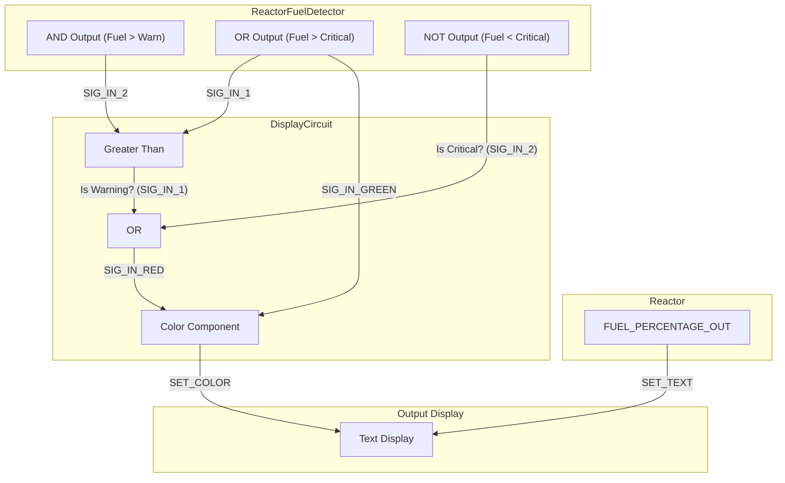

# Document 02: Color-Coded Reactor Fuel Display

---

### **DOCUMENT INFORMATION**

| Field | Value |
| :--- | :--- |
| **Document ID** | `02-ReactorFuelDisplay` |
| **Circuit Name**| Tri-State Fuel Gauge |
| **Author** | Xavrax |
| **Version** | 1.0 |
| **Classification** | Crew Comfort & Survival Systems |
| **Date**| 09.07.2k25 |

---

### 1. Circuit Overview

This document outlines a supplementary circuit for the `01-ReactorFuelDetector`. Its function is to provide an at-a-glance, color-coded status of the reactor's fuel level on a standard Text Display. The display shows the precise fuel percentage while changing its background color to reflect the operational status: green for nominal, yellow for caution, and red for "find a fuel rod before we all become fish food."

This system allows any crew member passing through the engine room to immediately assess the fuel situation without needing to interpret complex readouts, freeing up the engineering team to focus on more important things, like locating the source of that incessant clanging noise.

### 2. Functional Description

The circuit leverages the three primary logic outputs from the `01-ReactorFuelDetector` to control the `R` (Red) and `G` (Green) channels of a Color Component.

-   **Green Display (Nominal):** When the fuel level is above the `WARN_LEVEL`, the display is a calming green. This is achieved by feeding the `OK` signal (from `Doc-01 OR Gate`) into the Color Component's `Green` channel.
-   **Yellow Display (Warning):** When the fuel level is below the `WARN_LEVEL` but still above the `CRITICAL_LEVEL`, the display turns yellow. This is a mix of the `Red` and `Green` channels being active.
-   **Red Display (Critical):** When the fuel level drops below the `CRITICAL_LEVEL`, the display turns an alarming red. The `Green` channel is turned off, leaving only the `Red` channel active.

The reactor's `FUEL_PERCENTAGE_OUT` is wired directly to the Text Display, ensuring the exact percentage is always visible, regardless of the background color.

### 3. Required Components

-   1x Greater Than Component
-   1x OR Component
-   1x Color Component
-   1x Text Display
-   A completed and functional `01-ReactorFuelDetector` circuit
-   Wires (preferably not the ones the clown was just juggling)

### 4. Circuit Diagram

### 5. Installation & Wiring

*To be detailed in a future revision. For now, find Xavrax and ask for the schematic. Bribe with ethanol if necessary.*

### 6. OPERATIONAL NOTES & WARNINGS

-   :warning: **WARNING:** Incorrect wiring will, at best, result in confusing colors. At worst, it will result in a black, unlit display, which is the universal sign for "something is deeply wrong."
-   :information_source: **NOTE:** The color "yellow" is achieved by sending a `1` to both the red and green channels. If your display is stuck on yellow, you may have created an unintentional logic lock. Or the fuel is just perpetually in the warning zone.
-   :memo: **MEMO:** For maximum effectiveness, place the display in a high-traffic area. The shared anxiety of a perpetually yellow or red screen is a powerful motivator for the engineering team. 