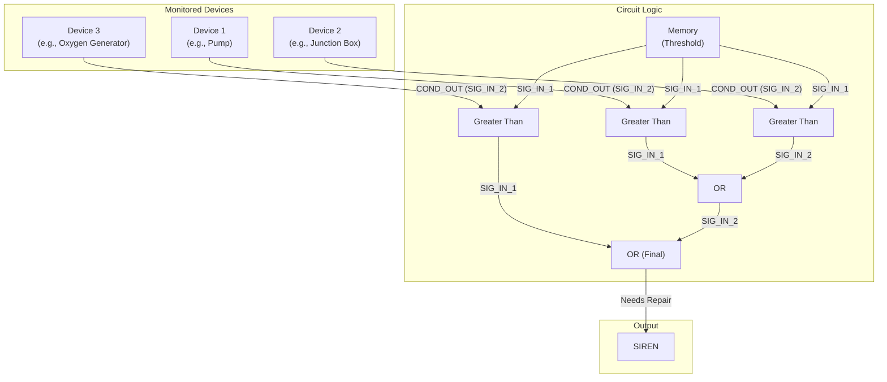

# Document 03: Proactive Device Condition Alert

---

### **DOCUMENT INFORMATION**

| Field | Value |
| :--- | :--- |
| **Document ID** | `03-DevicesConditionAlert` |
| **Circuit Name** | The "Something's About to Break" Alarm |
| **Author** | Xavrax |
| **Version** | 1.0 |
| **Classification**| Essential Maintenance Systems |
| **Date**| 11.07.2k25 |

---

### 1. Circuit Overview

This document describes the design of a modular, ship-wide device condition alert system. Its function is to consolidate the health status of numerous critical components into a single, impossible-to-ignore alarm. When the condition of any monitored device drops below a preset threshold, the circuit activates an output, alerting the crew that preventative maintenance is required.

This system is dedicated to the long-suffering engineer who is tired of discovering a pump is broken only *after* the ballast is full of water, or that a junction box has failed because the lights just went out. It's the ultimate tool for saying, "I told you so."

### 2. Functional Description

The core of the circuit is a series of "Greater Than" components, one for each monitored device. The logic checks if the `THRESHOLD > DEVICE_CONDITION`. If this is true, the component outputs a `1`, indicating the device needs repairs.

-   **Thresholds:** The integrity threshold is set using Memory Components. To conserve components, one Memory Component can provide the threshold for up to five devices, assuming they share a similar maintenance priority.
-   **Alarm Logic:** The individual "needs repair" signals are funneled through a tree of OR components. If any single device reports a poor condition, the signal travels up the chain, and the final OR gate outputs a `1`.
-   **Output:** The final signal is wired to an alarm, lamp, or other notification device. The recommended output is a very loud siren placed conveniently next to the designated wrench-turner's bunk.

### 3. Required Components (for X devices)

-   `X` Greater Than Components
-   `ceil(3 / 2)` OR Components (to create a logic tree)
-   `ceil(X / 5)` Memory Components
-   1 Output Device (e.g., Siren, Flashing Lamp)
-   The patience of a saint for the person who has to fix everything.

### 4. Circuit Diagram (Example for 3 Devices)

### 5. Potential Failure Scenarios (A Cautionary Tale)

-   **Silent Failure:** The alarm remains blissfully silent while the sub slowly disintegrates. This typically occurs when the junction box powering the alarm itself is the first to fail, creating a beautiful, silent, and deadly paradox. The crew's first sign of trouble is when they have to swim to the engine room.
-   **The Never-Ending Siren:** A faulty component or an overly ambitious threshold causes the alarm to sound. Constantly. The crew is faced with a choice: go mad from the noise, or systematically dismantle the alarm with a welding torch. They will choose the latter, rendering the system useless right before the reactor's condition dips into the red.
-   **The Boy Who Cried Crawler:** The system is accidentally wired to the medical fabricator, which is always at 99% condition. The constant, false alarms train the crew to ignore it completely. This works fine until the oxygen generator, also on the circuit, quietly rusts away, and everyone mysteriously develops a craving for bananas.

### 6. Installation & Wiring

*To be detailed in a future revision. For now, find Xavrax and ask for the schematic. Bribe with ethanol if necessary.*

### 7. OPERATIONAL NOTES & WARNINGS

-   :warning: **WARNING:** Setting the threshold above 100 will cause the alarm to be permanently active. While this may accurately reflect the general state of our vessel, it is not helpful.
-   :information_source: **NOTE:** This circuit is a tool for notification, not a substitute for regular inspections. It cannot detect if a crewmate has "fixed" a junction box with a crowbar and a roll of duct tape.
-   :memo: **MEMO:** The crew member who complains the most about the state of the ship's equipment is automatically nominated to be the first responder when the alarm sounds. 