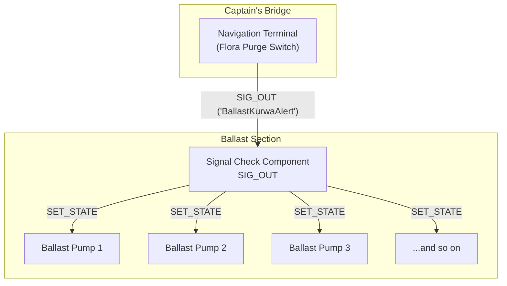

# Document 04: Emergency Ballast Flora Purge Switch

---

### **DOCUMENT INFORMATION**

| Field | Value |
| :--- | :--- |
| **Document ID** | `04-BallastFloraPompSwitch` |
| **Circuit Name** | The "BallastKurwaAlert" Protocol |
| **Author** | Xavrax |
| **Version** | 1.0 (The Only Version You'll Need) |
| **Classification**| CAPTAIN'S EYES ONLY (And engineers who don't want to become mulch) |
| **Date**| 18.07.2k25 |

---

### 1. Circuit Overview

This document details the single most important switch on this submarine. It is not for the coffee machine. It is not a master light switch. This is the "Not Today, Satan's Cabbage" button, a one-press solution to every captain's worst nightmare: a Ballast Flora outbreak.

When the inevitable happens—when you see that ghastly green tendril slither out of a ballast tank—this circuit allows for the immediate, decisive, and merciless shutdown of every single ballast pump on the vessel. This traps the flora, prevents its spread, and buys the crew precious time to find the flamethrower. It is, without exaggeration, the only thing standing between the crew and a horrible, photosynthetic death.

### 2. Functional Description

The circuit's beauty lies in its brutal simplicity. It operates on a single, custom-named signal that propagates from the bridge to the ballast.

1.  **Activation:** The Captain, from the safety of the bridge, flips a switch or presses a designated button on the Navigation Terminal.
2.  **Signal Propagation:** This action changes the terminal's output from a benign "OK" to the custom, panic-inducing signal: "**BallastKurwaAlert**".
3.  **Pump Shutdown:** A Signal Check Component, placed strategically near the ballast pumps, is perpetually listening for this exact signal. The moment it detects "BallastKurwaAlert", it immediately changes its own output to `0`, which is wired to the `SET_STATE` of every pump, shutting them all down instantly.

When the switch is in the "safe" position, it sends "OK", which the Signal Check Component ignores, causing it to send a `1` and allowing the pumps to operate normally.

### 3. Required Components (for X pumps)

-   1x Switch (or an open slot on the Navigation Terminal for the Captain to dramatically smash).
-   `ceil(X / 5)` Signal Check Components.
-   `X + 1` Wires.
-   One (1) Captain with the steely resolve to sacrifice pump functionality for crew survival.

### 4. Configuration Settings

| Component | Parameter | Recommended Value | Purpose & Notes |
| :--- | :--- | :--- | :--- |
| **Switch / Terminal** | `OUTPUT` | `OK` | The "all clear" signal. Keep this signal boring. |
| | `FALSE_OUTPUT` | `BallastKurwaAlert` | The custom panic signal. The name is critical. Do not misspell. |
| **Signal Check Comp.** | `TARGET_SIGNAL` | `BallastKurwaAlert` | The phrase it's listening for. Case-sensitive. |
| | `OUTPUT` | `0` | What it sends to the pumps when it hears the target. (Off) |
| | `FALSE_OUTPUT` | `1` | What it sends otherwise. (On) |

### 5. Circuit Diagram

### 6. Installation & Wiring

*To be detailed in a future revision. For now, find Xavrax and ask for the schematic. Bribe with ethanol if necessary.*

### 7. OPERATIONAL NOTES & WARNINGS

-   :warning: **WARNING:** This is a manual override. It will not activate on its own. If the Captain is dead, asleep, or busy wrestling a clown, the pumps will continue to run, happily spreading green death throughout the sub.
-   :information_source: **NOTE:** This circuit only turns the pumps *off*. It does not turn them back on. The Captain must manually deactivate the switch once the... unpleasantness... has been dealt with.
-   :memo: **MEMO:** Do not, under any circumstances, wire this switch next to the "Jettison Cargo" button. The ensuing confusion will be brief, hilarious, and fatal. Also, do not tell the clown what "BallastKurwaAlert" does. You will regret it.
