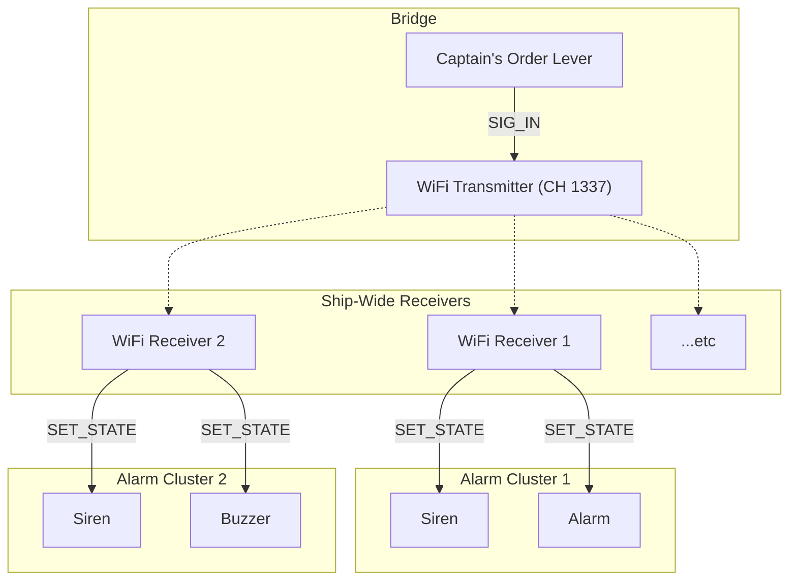

# Document 06: The Captain's Ordering Signal

---

### **DOCUMENT INFORMATION**

| Field | Value |
| :--- | :--- |
| **Document ID** | `06-CaptainOrderingSignal` |
| **Circuit Name** | The "Everybody Shut Up" Broadcast System |
| **Author** | Xavrax |
| **Version** | 1.0 |
| **Classification**| Command & Control Infrastructure |
| **Date**| 18.07.2k25 |

---

### 1. Circuit Overview

This document details the highest priority alert system on this vessel: The Captain's Ordering Signal. Its function is singular and non-negotiable. When activated, it broadcasts a signal that triggers alarms and sirens across the entire submarine for one purpose: to make every single crew member, regardless of rank or current state of panic, shut their mouths and listen to the Captain's orders.

This circuit exists because verbal commands are often lost in the glorious symphony of hull breaches, monster attacks, reactor alarms, and the clown honking for no particular reason. This is the Captain's tool to cut through that noise and restore order before a minor crisis becomes a major underwater obituary.

### 2. Functional Description

The system is a master-slave wireless network controlled by a single lever on the bridge.

1.  **Activation:** The Captain, presumably with a stern look on their face, flips the dedicated "Order" lever.
2.  **Broadcast:** The lever's `SIGNAL_OUT` is wired to a master WiFi Component. Upon activation, the lever sends the signal `captain_shut_the_fuck_up_alert`. This signal is then broadcast ship-wide on the command channel `1337`, as outlined in the [05-ChannelDistribution.md](05-ChannelDistribution.md) doctrine.
3.  **Reception & Alarm:** Slave WiFi components, strategically placed throughout the sub, are tuned to the same channel. When they receive the `captain_shut_the_fuck_up_alert` signal, their `SIGNAL_OUT` changes to `1`. This signal is wired to the `SET_STATE` of every connected alarm, siren, and buzzer, unleashing a deafening, unified cacophony that cannot be ignored.

When the lever is deactivated, it sends a `0`, which the receiving components ignore, silencing the alarms.

### 3. Required Components

-   1x Lever (To be installed with appropriate dramatic lighting)
-   1 + X WiFi Components (1 transmitter, X receivers)
-   Up to `X * 5` Sirens, Alarms, or Buzzers (The more annoying, the better)
-   Enough wire to make the Quartermaster question your sanity.

### 4. Configuration Settings

| Component | Parameter | Recommended Value | Purpose & Notes |
| :--- | :--- | :--- | :--- |
| **Lever** | `OUTPUT` | `captain_shut_the_fuck_up_alert` | The only thing this lever should ever say. |
| | `FALSE_OUTPUT`| `0` | Ensures silence when not in use. |
| **WiFi (Transmitter)** | `CHANNEL` | `1337` | The sacred command channel. |
| **WiFi (Receivers)** | `CHANNEL` | `1337` | Must match the transmitter, obviously. |

### 5. Circuit Diagram

### 6. OPERATIONAL NOTES & WARNINGS

-   :warning: **WARNING:** This system's effectiveness is based on its rarity. Using it to demand a fresh cup of coffee or to complain about the music in the mess hall will result in the crew using the lever for "unscheduled buoyancy tests" when the Captain is sleeping.
-   :information_source: **NOTE:** The `captain_shut_the_fuck_up_alert` signal is, by design, alarming. Frivolous use may cause panicked crew members to accidentally discharge their weapons, flood the wrong ballast, or jettison the Captain's private stash of ethanol.
-   :memo: **MEMO:** A wise Captain ensures the lever is behind a locked door that only they (and maybe a trusted Security Officer) can access. Giving the clown a key to this room is grounds for an immediate and justified mutiny. 