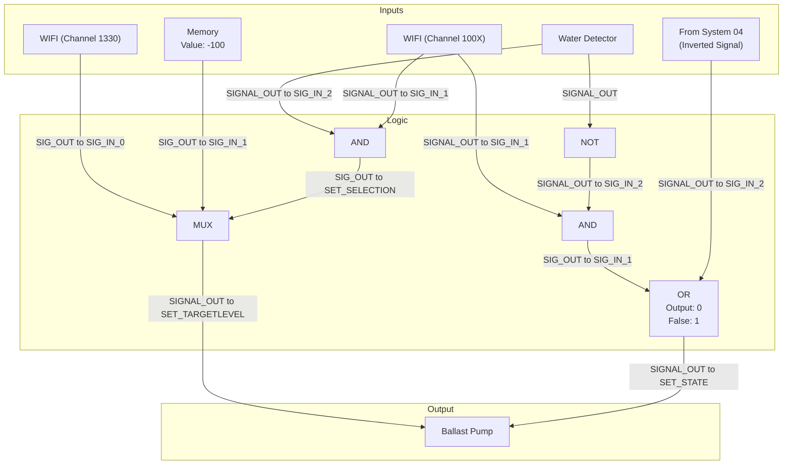

# Document 07: Situational Ballast Flora Purge System

---

### **DOCUMENT INFORMATION**

| Field | Value |
| :--- | :--- |
| **Document ID** | `07-PurgeAllWater` |
| **Circuit Name**| Situational Ballast Flora Purge System |
| **Related Documents** | `04-BallastFloraPompSystem.md`, `05-ChannelDistribution.md` |
| **Author** | Xavrax |
| **Version** | 1.0 (Handle with care, may drain ocean) |
| **Classification**| Standard Operating Procedure |
| **Date**| 26t stat.07.2k25 |

---

### 1. Overview

This document details an advanced, situational circuit designed to supplement the preventative measures outlined in `04-BallastFloraPompSystem.md`. While the primary system is crucial for preventing the initial injection of ballast flora, this secondary system provides a powerful countermeasure to stop an active infestation from spreading.

By receiving a targeted purge command, this circuit will forcibly drain all water from the specified ballast tank, leaving any flora high and dry. This simplifies containment efforts and makes it significantly easier to fire the neutralized flora out of the ballast. Its use is situational, intended for moments when an infection has already taken hold.

---

### 2. Required Components

| Component | Quantity | Notes |
| :--- | :--- | :--- |
| Circuit Box | 1 | Optional, but highly recommended for clean wiring. |
| WIFI Component| 2 | One for receiving the purge command, one for navigation data. |
| Memory Component| 1 | Stores the "full purge" water level value. |
| AND Component | 2 | For conditional logic. |
| OR Component | 1 | Required for integrating with the system from doc `04-BalastFloraPompSystem.md`. |
| NOT Component | 1 | For inverting the water detector signal. |
| MUX Component | 1 | For switching the pump's target level. |
| Water Detector| 1 | To check if the ballast tank is empty. |

---

### 3. Circuit Diagram

---

### 4. Connections & Logic

The circuit operates in two main parts: setting the pump's target water level and controlling its power state. All wireless channels are used as defined in `05-ChannelDistribution.md`.

1.  **Pump Target Level (`SET_TARGETLEVEL`)**:
    *   A **MUX** component dynamically sets the pump's target level.
    *   `SIG_IN_0` is connected to a **WIFI component** on channel `1330`, receiving the vessel's `y_velocity`. This is the default target.
    *   `SIG_IN_1` is connected to a **Memory component** storing a value of `-100`, representing a full purge.
    *   An **AND component (`AND1`)** controls the MUX's selection. It takes input from the **Water Detector** and the `100X` channel **WIFI component**.
    *   **Logic:** When a purge signal is received on channel `100X` AND the Water Detector senses water, `AND1` sends a `1` to the `MUX`, selecting the `-100` purge value. Otherwise, the pump's target defaults to the `y_velocity`.

2.  **Pump Power State (`SET_STATE`)**:
    *   An **OR component** (configured with `output: 0, false_output: 1`) controls the pump's power state. It will turn the pump OFF (`0`) if any input is `1`.
    *   The first condition for turning off the pump is handled by `AND2`. It receives input from the `100X` **WIFI component** and an inverted signal from the **Water Detector** (via a `NOT` component).
    *   The second condition is an inverted signal from the `04-BallastFloraPompSystem` circuit.
    *   **Logic:** The pump will be turned OFF (`0`) if:
        *   The purge command (`100X`) is active AND the water detector is dry (meaning the purge is complete).
        *   OR the primary pump system from document `04` commands it.
    *   If neither of these "off" conditions is met, the OR component's `false_output` sends a `1` to the pump's `SET_STATE`, keeping it active.

---

### 5. Important Notes

-   :warning: **CRITICAL:** When integrating this circuit with the system from `04-BallastFloraPompSystem.md`, the original connection from that system to the pump's `SET_STATE` **must be removed**. This circuit's `OR` component output replaces it, effectively giving both systems control over the pump's power.
-   :information_source: **NOTE:** This system is intentionally aggressive. Activating it will drain the target ballast tank completely, which will affect the submarine's trim. Use with caution.
-   :memo: **MEMO:** The optional **Circuit Box** is highly recommended to keep the wiring for this and the primary system organized and prevent signal interference or accidental disconnections. 