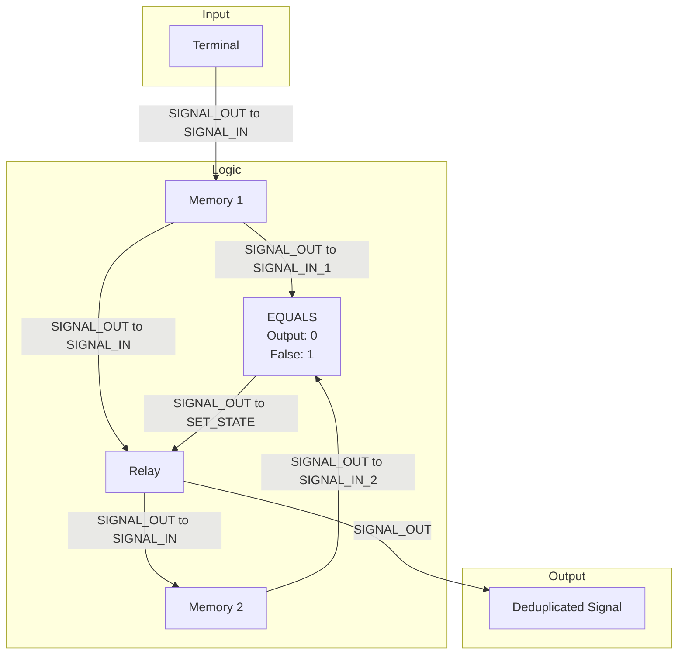

# Document 09: Terminal Message Deduplicator

---

### **DOCUMENT INFORMATION**

| Field | Value |
| :--- | :--- |
| **Document ID** | `09-TerminalDeduplicator` |
| **Circuit Name**| Terminal Message Deduplicator |
| **Author** | Xavrax |
| **Version** | 1.0 (It's not a bug, it's a feature) |
| **Classification**| Standard Operating Procedure |
| **Date**| 27.07.2k25 |

---

### 1. Overview

This document describes a circuit designed to mitigate the issue of duplicate messages from ship terminals. Due to the nature of the server's update frequency (tick rate), a single command pulse from a terminal can often be registered multiple times, leading to unintended command repetition.

This circuit attempts to solve this by comparing the last received signal with the one before it. If they are identical, it blocks the signal from passing through. While not a perfect solution, it is the most effective method available to us at this time and significantly reduces command spam.

---

### 2. Required Components

| Component | Quantity | Notes |
| :--- | :--- | :--- |
| Memory Component| 2 | For storing previous signals. |
| EQUALS Component| 1 | For comparing signals. Set `output: 0`, `false_output: 1`. |
| Relay Component | 1 | To act as a gate for the signal. |
| Patience & Luck| A lot | This circuit can be finicky. |

---

### 3. Circuit Diagram

---

### 4. Connections & Logic

1.  The `SIGNAL_OUT` from the **Terminal** is connected to the `SIGNAL_IN` of the first **Memory Component (`MEM1`)**.
2.  The `SIGNAL_OUT` from `MEM1` is split and connected to two places:
    *   The `SIGNAL_IN_1` of the **EQUALS Component**.
    *   The `SIGNAL_IN` of the **Relay Component**.
3.  The `SIGNAL_OUT` from the **Relay** is connected to the `SIGNAL_IN` of the second **Memory Component (`MEM2`)**.
4.  The `SIGNAL_OUT` from `MEM2` is connected to the `SIGNAL_IN_2` of the **EQUALS Component**.
5.  The `SIGNAL_OUT` from the **EQUALS Component** is connected to the `SET_STATE` of the **Relay**.
6.  The final, deduplicated output of this circuit is the `SIGNAL_OUT` from the **Relay Component**.

**Logic:** The circuit stores the current signal (`MEM1`) and the previously sent signal (`MEM2`). The **EQUALS Component** (configured with `output: 0`, `false_output: 1`) compares them.
*   If the signals are **different**, the EQUALS component outputs `1` (`false_output`), which turns the **Relay ON** and allows the new signal to pass through.
*   If the signals are **identical**, the EQUALS component outputs `0` (`output`), which turns the **Relay OFF** and blocks the duplicate signal.
The final, deduplicated output is taken from the Relay's `SIGNAL_OUT`.

---

### 5. Important Notes

-   :warning: **LIMITATION:** This system is not flawless. Due to server tick rate and signal propagation delays, very rapid, identical commands might occasionally bypass the filter. It is a best-effort solution.
-   :information_source: **NOTE:** This circuit is essential for any terminal setup intended to send single-pulse commands to sensitive systems (e.g., door controls, reactor management) to prevent accidental double-activation. 