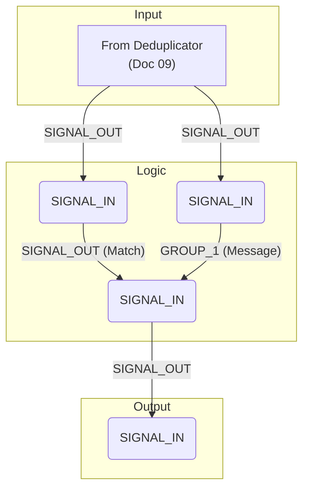

# Document 10: Echo Command Circuit

---

### **DOCUMENT INFORMATION**

| Field | Value |
| :--- | :--- |
| **Document ID** | `10-EchoCommand` |
| **Circuit Name**| Echo Command Handler |
| **Related Documents** | `05-ChannelDistribution.md`, `08-TerminalCommands.md`, `09-TerminalDeduplicator.md` |
| **Author** | Xavrax |
| **Version** | 1.0 |
| **Classification**| Standard Operating Procedure |
| **Date**| 27.07.2k25 |

---

### 1. Overview

This document describes the circuit responsible for handling the `echo` command from a terminal. This circuit takes a string from the terminal (after it has been processed by the deduplicator from `09-TerminalDeduplicator.md`), verifies it is a valid `echo` command, extracts the message payload, and broadcasts it over the general chat channel.

---

### 2. Required Components

| Component | Quantity | Notes |
| :--- | :--- | :--- |
| REGEX Find Component| 2 | For command validation and message extraction. |
| Relay Component | 1 | To gate the message broadcast. |
| WIFI Component | 1 | To transmit the final message. |

---

### 3. Configuration

| Component | Setting | Value |
| :--- | :--- | :--- |
| **REGEX Find 1** | Expression | `^\s*echo\b\s*(.*)` |
| **REGEX Find 2** | Expression | `^\s*echo\b\s*(.*)` |
| **WIFI Component**| Channel | `0000` (as per `05-ChannelDistribution.md`) |

---

### 4. Circuit Diagram

---

### 5. Connections & Logic

1.  The deduplicated signal from the circuit in `09-TerminalDeduplicator.md` is connected to the `SIGNAL_IN` of both **REGEX Find Components**.
2.  `REGEX1` is used for validation. Its `SIGNAL_OUT` is connected to the `SET_STATE` of the **Relay**.
3.  `REGEX2` is used for message extraction. Its `GROUP_1` output (which contains the captured text from the `(.*)` part of the expression) is connected to the `SIGNAL_IN` of the **Relay**.
4.  The `SIGNAL_OUT` from the **Relay** is connected to the `SIGNAL_IN` of the **WIFI Component**.

**Logic:**
*   When a command is received, both REGEX components test it.
*   If the command matches the `echo` format, `REGEX1` will output the full matched string (e.g., "echo hello"). Any non-empty string signal to the `SET_STATE` pin is treated as a `1`, which turns the **Relay ON**.
*   Simultaneously, `REGEX2` also matches and extracts the message portion of the command (e.g., "hello") into its `GROUP_1` output.
*   Because the Relay is now ON, it allows the message from `REGEX2`'s `GROUP_1` output to pass through to the **WIFI Component**, which then broadcasts it on channel `0000`.
*   If the command is not a valid `echo` command, `REGEX1` outputs nothing, the Relay remains OFF, and no signal is sent. 