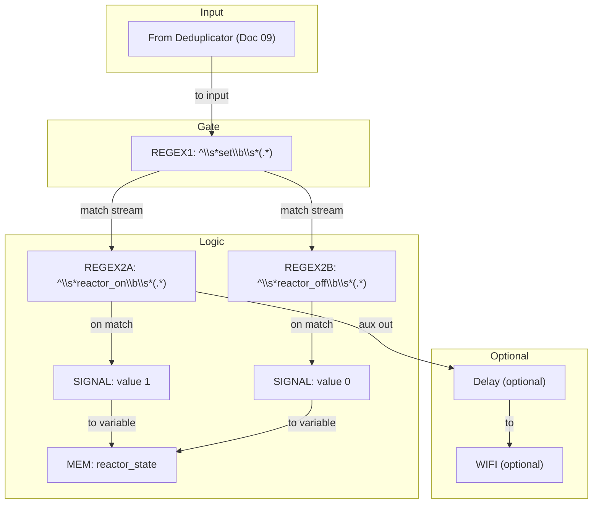

# Document 11: Setter Commands (Because Buttons Are Too Mainstream)

---

### **DOCUMENT INFORMATION**

| Field | Value |
| :--- | :--- |
| **Document ID** | `11-SetterCommands` |
| **Circuit Name**| Terminal Variable Setter |
| **Related Documents** | `05-ChannelDistribution.md`, `08-TerminalCommands.md`, `09-TerminalDeduplicator.md` |
| **Author** | Xavrax |
| **Version** | 1.0 |
| **Classification**| Standard Operating Procedure |
| **Date**| 27.07.2k25 |

---

### 1. Overview

This document outlines a simple but extensible circuit for handling terminal-based "set" commands, so you can toggle variables like a pro without rewiring the sub every five minutes. The pattern lets you define multiple commands (variables) that can be routed to memory or sent onward (e.g., via WIFI) to other systems.

It pairs with the deduplicator from `09-TerminalDeduplicator.md` to avoid multi-tick spam. Use carefully—you're wiring text commands directly into systems.

---

### 2. Required Components

Where \(X\) is the number of variables you want to set.

| Component | Quantity | Notes |
| :--- | :--- | :--- |
| REGEX Components | \(X + \lceil X/5 \rceil\) | One REGEX to detect the `set` prefix, plus roughly one REGEX per variable. If commands are long/complex, add more. |
| SIGNAL Components | X | Each maps a matched command to a specific output value (e.g., 1 or 0). |
| MEM Components | X | Optional sinks for storing the current value of each variable. |
| Delay Components | Optional | Useful if you need pulse stretching or sequencing. |

---

### 3. Configuration

- **REGEX1 (Set gate):** Expression: `^\s*set\b\s*(.*)`
- **REGEX2..N (Per-variable matchers):** For each variable/command, use an expression like: `^\s*<command>\b\s*(.*)`
  - Example commands: `reactor_on`, `reactor_off`, `lights 1`, `lights 0`
- **SIGNAL components:** Set the constant/output to the value you want to write (e.g., `1` for enable, `0` for disable), or forward the captured value depending on your setup.
- **MEM components:** No config required beyond default; they store the incoming value.
- **WIFI (optional):** If forwarding values, pick an appropriate channel per `05-ChannelDistribution.md`.

---

### 4. Circuit Diagram (Pattern for a Few Variables)

---

### 5. Connections & Logic

The circuit is intentionally simple and scales with the number of variables you want to control.

1. Input from the terminal deduplicator (`09-TerminalDeduplicator.md`) connects to `REGEX1` (the set gate):
   - `REGEX1` Expression: `^\s*set\b\s*(.*)`
2. The output of `REGEX1` feeds each per-variable `REGEX` (`REGEX2..N`), where each has a specific expression like:
   - `^\s*<command>\b\s*(.*)`
   - Example: `^\s*reactor_on\b\s*(.*)` or `^\s*lights\s*0\b\s*(.*)`
3. Each `REGEX2` output connects to its corresponding `SIGNAL` component, which holds the expected value (e.g., `1` or `0`).
4. Each `SIGNAL` output can then be wired to a `MEM` component (to store the state) or directly into another circuit.
5. Optional `Delay` components can be used as additional outputs from the per-variable `REGEX` to create pulses or sequence signals.
6. If you wish to forward variable updates across the sub, connect the resulting signals to a `WIFI` component and select a channel as per `05-ChannelDistribution.md`.

---

### 6. Notes & Tips

- Keep command names unambiguous and short. Avoid overlaps like `set light` and `set lights`.
- Group related variables into separate circuit boxes to keep wiring clean.
- For boolean toggles, pair commands (`<name>_on`, `<name>_off`) and route both into the same `MEM`.
- If you need to carry numeric values, consider capturing groups and a small parser circuit—this document focuses on discrete setters.
- Test with the deduplicator connected. Without it, you may see multi-tick retriggers.

---

### 7. Example Command Set (X = 5)

For five variables, you would typically use: `5` SIGNALs, `5` MEMs, and approximately `5 + ceil(5/5) = 6` REGEX components (1 set gate + 5 per-variable).

Example commands:
- `set reactor_on`
- `set reactor_off`
- `set lights 1`
- `set lights 0`
- `set doors_locked`

Result: Each command flows `DEDUP -> REGEX1(set) -> REGEX(command) -> SIGNAL(value) -> MEM/Output`, and can be optionally forwarded via WIFI. 